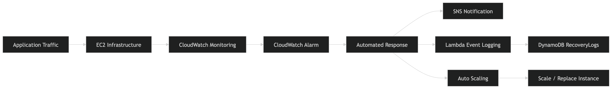
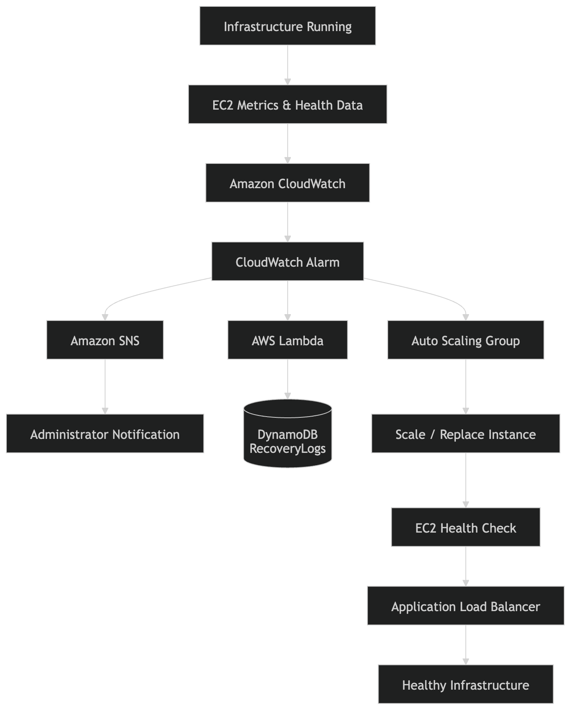
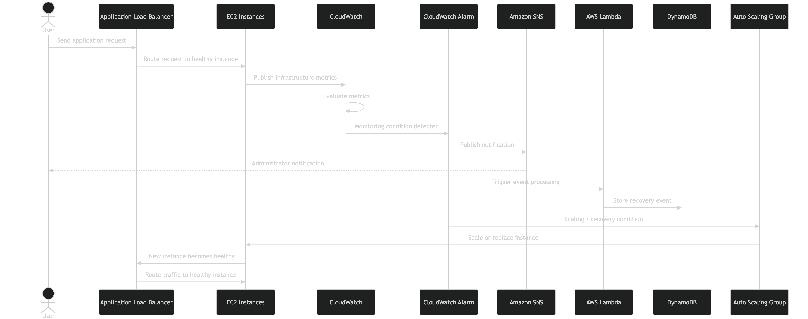
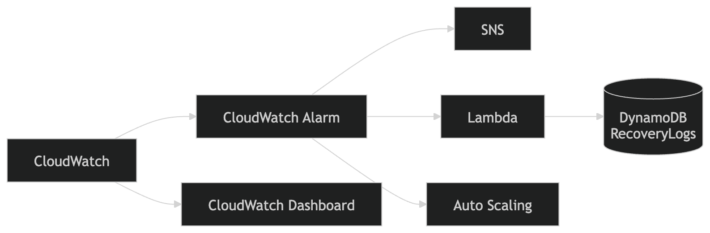

# Cloud-Based Self-Healing Infrastructure Monitoring System

<p align="center">
  <strong>Automated Monitoring • Fault Detection • Recovery • Observability</strong>
  <br><br>
  
  
  
  
  
  
</p>

---

## 📌 Overview

The Cloud-Based Self-Healing Infrastructure Monitoring System is an AWS-based cloud infrastructure project designed to improve application availability, scalability, reliability, and operational resilience.

The system continuously monitors infrastructure health using Amazon CloudWatch, detects abnormal conditions through alarms, sends notifications through Amazon SNS, records monitoring and recovery events using AWS Lambda and Amazon DynamoDB, and uses Amazon EC2 Auto Scaling to automatically scale or replace infrastructure when required.

The project was developed in two major stages:

- Sprint 1: Core cloud infrastructure and monitoring
- Sprint 2: Event-driven automation, recovery logging, notifications, and observability

### Core Workflow

Monitor → Detect → Alert → Log → Recover → Observe

---

## 🏗️ System Architecture

The following architecture represents the complete system and its major AWS components.

<p align="center">
  
</p>

---

## 🔄 How the System Works

The system operates as an event-driven monitoring and recovery pipeline.

<p align="center">
  
</p>

### 1. Application Traffic

Users access the application through the Application Load Balancer (ALB).

```text
User
  │
  ▼
Application Load Balancer
  │
  ├──────────────┐
  ▼              ▼
EC2 Instance 1  EC2 Instance 2
  │              │
  └──────┬───────┘
         ▼
     Application
```

The ALB distributes incoming requests across healthy EC2 instances.

### 2. Infrastructure Monitoring

The infrastructure is monitored using Amazon CloudWatch.

The monitoring layer observes infrastructure metrics such as:

- CPU Utilization
- Request Count
- Healthy Host Count
- Instance Count
- Infrastructure health

CloudWatch provides the monitoring layer required to identify abnormal infrastructure behavior.

### 3. Alarm Detection

When a configured monitoring condition is exceeded, the CloudWatch alarm transitions into an alarm state.

```text
Infrastructure Metrics
        │
        ▼
Amazon CloudWatch
        │
        ▼
CloudWatch Alarm
        │
        ▼
Condition Detected
```

This creates the event that initiates the automated response workflow.

---

## 🚨 Failure Detection & Recovery Architecture

The complete failure-handling workflow is:

<p align="center">
  
</p>

### Important Architectural Separation

The system uses different AWS services for different responsibilities:

- CloudWatch: Monitoring and metric collection
- CloudWatch Alarm: Detecting configured abnormal conditions
- SNS: Sending notifications
- Lambda: Processing alarm events and recording them
- DynamoDB: Storing recovery/event logs
- Auto Scaling: Scaling infrastructure and replacing unhealthy or terminated instances
- ALB: Routing traffic to available healthy instances

> Lambda does not directly replace EC2 instances. Auto Scaling performs infrastructure scaling and instance replacement. Lambda is used to process the event and record it in DynamoDB.

---

## 🔁 Self-Healing Sequence

The following sequence shows what happens when an infrastructure problem is detected.

<p align="center">
  
</p>

---

## 💥 Example Failure Scenario

Consider a scenario where one EC2 instance becomes unhealthy.

### Normal State

```text
                Application Load Balancer
                     /            \
                    /              \
                   ▼                ▼
              EC2 Instance 1   EC2 Instance 2
                   ✓                ✓
```

Both instances are healthy and capable of serving traffic.

### Failure Detected

```text
                Application Load Balancer
                     /            \
                    /              \
                   ▼                ▼
              EC2 Instance 1   EC2 Instance 2
                   ✓                ✗
                                    │
                                    ▼
                              Health Failure
```

The infrastructure monitoring and health-check mechanisms detect the abnormal state.

### Automated Recovery

```text
                 CloudWatch
                     │
                     ▼
              CloudWatch Alarm
                /           \
               /             \
              ▼               ▼
            SNS             Auto Scaling
             │                   │
             ▼                   ▼
      Administrator Alert   Replace Instance
                                 │
                                 ▼
                           New EC2 Instance
                                 │
                                 ▼
                           Health Check
                                 │
                                 ▼
                         Healthy Instance
```

At the same time:

```text
CloudWatch Alarm
       │
       ▼
    Lambda
       │
       ▼
   DynamoDB
       │
       ▼
 RecoveryLogs
```

---

## 📊 Monitoring & Observability

A CloudWatch Dashboard provides a centralized view of infrastructure health and system behavior.

### Dashboard Metrics

```text
┌─────────────────────────────────────────────┐
│           CLOUDWATCH DASHBOARD              │
├─────────────────────────────────────────────┤
│                                             │
│  CPU Utilization                            │
│  Request Count                              │
│  Healthy Host Count                         │
│  Instance Count                             │
│                                             │
│  Infrastructure Health                      │
│  Scaling Behaviour                          │
│                                             │
└─────────────────────────────────────────────┘
```

The dashboard helps visualize:

- workload patterns
- infrastructure health
- traffic
- instance availability
- scaling behavior

---

## 🗄️ Recovery Event Logging

Recovery and monitoring events are stored in an Amazon DynamoDB table named RecoveryLogs.

### Data Model

| Attribute | Description |
| --- | --- |
| id | Unique event identifier |
| timestamp | Time at which the event occurred |
| message | Description of the event |

### Example Event

```json
{
  "id": "event-001",
  "timestamp": "2026-04-10T12:30:00Z",
  "message": "CloudWatch alarm triggered due to high CPU utilization"
}
```

The event log provides a persistent record of system events and recovery activity.

---

## ☁️ AWS Services Used

### Compute

- Amazon EC2: Provides the compute instances used to host the application.
- EC2 Launch Template: Defines the configuration used when launching EC2 instances.
- EC2 Auto Scaling: Maintains desired infrastructure capacity and provides automated scaling and instance replacement.

### Networking

- Application Load Balancer: Distributes incoming application traffic across available instances.
- Target Groups: Maintain the EC2 targets associated with the load balancer and perform health checks.

### Monitoring

- Amazon CloudWatch: Collects infrastructure metrics and provides monitoring capabilities.
- CloudWatch Alarms: Evaluate configured conditions and initiate automated actions when thresholds are breached.
- CloudWatch Dashboard: Provides centralized visualization of system health and infrastructure behavior.

### Automation

- AWS Lambda: Processes CloudWatch alarm events and records event information in DynamoDB.
- Amazon SNS: Provides notification delivery for infrastructure events and alarms.

### Storage

- Amazon DynamoDB: Stores recovery and monitoring event information in the RecoveryLogs table.

### Security

- AWS IAM: Controls permissions and access between AWS resources.
- EC2 Security Groups: Control inbound and outbound network access to EC2 instances.

---

## 🧩 Technology Stack

| Category | Technology |
| --- | --- |
| Cloud Platform | AWS |
| Compute | Amazon EC2 |
| Load Balancing | Application Load Balancer |
| Scaling | EC2 Auto Scaling |
| Monitoring | Amazon CloudWatch |
| Alerting | Amazon SNS |
| Serverless | AWS Lambda |
| Database | Amazon DynamoDB |
| Security | AWS IAM, Security Groups |
| Application Server | Apache HTTP Server |
| OS Environment | Linux-based EC2 environment |

---

## 🚀 Project Development

The project was developed through two major sprints.

### Sprint 1 — Core Infrastructure

The first sprint established the foundation:

<p align="center">
  
</p>

- EC2 deployment
- IAM configuration
- Security groups
- Application server deployment
- Launch Template
- Target Groups
- Application Load Balancer
- Health checks
- Auto Scaling
- CloudWatch monitoring

### Sprint 2 — Automation & Observability

The second sprint extended the infrastructure:

<p align="center">
  
</p>

- CloudWatch alarms
- SNS notifications
- Lambda event processing
- DynamoDB recovery logging
- Auto Scaling recovery
- CloudWatch Dashboard
- Integrated failure testing

---

## 🧪 Testing

The system was tested under both normal and failure conditions.

### Infrastructure Testing

- EC2 instance deployment
- EC2 web-server accessibility
- User Data execution
- IAM role configuration
- IAM permission validation
- Target Group configuration
- ALB health checks
- ALB traffic distribution

### Monitoring Testing

- CloudWatch metric collection
- CloudWatch alarm configuration
- CPU stress testing
- Alarm triggering
- Alarm recovery
- Metric visibility

### Automation Testing

- Lambda creation
- Lambda manual testing
- CloudWatch-triggered Lambda execution
- Auto Scaling configuration
- CPU-based scaling
- Instance replacement
- Health-check-based recovery

### Database Testing

- DynamoDB table creation
- Recovery event insertion
- Event log visibility
- Attribute validation

---

## 🔬 Failure Simulation

The project uses controlled failure/load scenarios to verify the monitoring and recovery pipeline.

```text
Generate CPU / Infrastructure Load
                │
                ▼
        CloudWatch Metric
                │
                ▼
         CloudWatch Alarm
                │
       ┌────────┼────────┐
       ▼        ▼        ▼
      SNS     Lambda    Auto Scaling
       │        │        │
       ▼        ▼        ▼
     Alert    DynamoDB  Recovery
                │
                ▼
         RecoveryLogs
```

This validates the complete event-driven workflow rather than testing each service in isolation.

---

## 🔐 Security

Security was incorporated through AWS access-control and network-control mechanisms.

### IAM

IAM roles and permissions control access between AWS resources.

### Security Groups

Security groups control network traffic to EC2 instances.

### Access Control

The infrastructure separates:

- application traffic
- administrative access
- AWS service permissions

The design follows the principle of restricting resource access to required permissions and network paths.

---

## 📈 Key Outcomes

The completed system integrates:

```text
                    ┌──────────────────┐
                    │    Monitoring    │
                    └────────┬─────────┘
                             │
                             ▼
                    ┌──────────────────┐
                    │    Detection     │
                    └────────┬─────────┘
                             │
                             ▼
                    ┌──────────────────┐
                    │     Alerting     │
                    └────────┬─────────┘
                             │
                ┌────────────┴────────────┐
                ▼                         ▼
       ┌─────────────────┐       ┌─────────────────┐
       │ Event Logging   │       │ Infrastructure  │
       │ Lambda + DB     │       │ Recovery        │
       └─────────────────┘       └─────────────────┘
                                         │
                                         ▼
                                ┌─────────────────┐
                                │ Healthy System  │
                                └─────────────────┘
```

### Major capabilities

- Automated infrastructure monitoring
- Application load balancing
- Infrastructure scaling
- EC2 instance replacement
- Health-check-based recovery
- Alarm-driven notifications
- Event logging
- Centralized monitoring dashboard
- Reduced manual intervention
- Event-driven infrastructure management

---

## 🧠 Why This System Is Self-Healing

A traditional monitoring workflow may look like:

```text
Failure
   ↓
Detection
   ↓
Alert
   ↓
Human Intervention
   ↓
Recovery
```

This project automates the infrastructure response:

```text
Failure / Abnormal Condition
            ↓
        Detection
            ↓
      CloudWatch Alarm
            ↓
    ┌───────┴────────┐
    ▼                ▼
   SNS            Auto Scaling
    │                │
    ▼                ▼
  Alert         Scale / Replace
                     │
                     ▼
              Healthy System
```

At the same time, the event is logged:

```text
CloudWatch Alarm
       ↓
    Lambda
       ↓
   DynamoDB
       ↓
 RecoveryLogs
```

Therefore, the system combines monitoring, notification, event logging, and automated infrastructure recovery into an integrated cloud workflow.

---

## 📁 Suggested Repository Structure

```text
cloud-based-self-healing-infrastructure/
│
├── README.md
│
├── lambda/
│   └── recovery_logger.py
│
├── scripts/
│   └── ec2-user-data.sh
│
├── infrastructure/
│   ├── ec2/
│   ├── load-balancer/
│   ├── auto-scaling/
│   ├── cloudwatch/
│   └── iam/
│
├── docs/
│   ├── architecture/
│   ├── screenshots/
│   └── testing/
│
└── tests/
    └── test-cases.md
```

> This represents a recommended organization for the GitHub repository. It is not intended to claim that the original project used this exact folder structure.

---

## 🔮 Future Enhancements

The current system provides a foundation for further improvements.

### Predictive Failure Detection

Machine learning could be introduced to analyze historical infrastructure metrics and predict failures before they occur.

```text
Historical Metrics
       ↓
Machine Learning Model
       ↓
Failure Prediction
       ↓
Preventive Infrastructure Action
```

### Multi-Cloud Support

The architecture could be extended beyond AWS to support multiple cloud providers.

```text
           Self-Healing Platform
                  │
       ┌──────────┼──────────┐
       ▼          ▼          ▼
      AWS       Azure     Google Cloud
```

### Advanced Security Automation

Future versions could incorporate:

- automated threat detection
- security event analysis
- automated mitigation
- centralized security monitoring

### Advanced Observability

Future dashboard improvements could include:

- richer real-time analytics
- custom reporting
- historical recovery analysis
- infrastructure health trends

### Cost Optimization

Automated resource optimization could balance:

```text
Performance
     ↕
Availability
     ↕
Infrastructure Cost
```

---

## 📚 Learning Outcomes

This project provided practical experience with:

- AWS cloud infrastructure
- EC2 administration
- Application Load Balancing
- Auto Scaling
- CloudWatch monitoring
- CloudWatch alarms
- Event-driven architecture
- AWS Lambda
- Amazon SNS
- DynamoDB
- IAM
- Infrastructure health checks
- Automated recovery
- Failure simulation
- Cloud observability
- Cloud infrastructure troubleshooting

---

## 👩‍💻 Project Development Approach

The project followed an iterative sprint-based approach.

```text
                    PROJECT
                       │
          ┌────────────┴────────────┐
          │                         │
          ▼                         ▼
      SPRINT 1                  SPRINT 2
          │                         │
          ▼                         ▼
  Core Infrastructure       Automation &
                            Observability
          │                         │
          ├── EC2                   ├── SNS
          ├── IAM                   ├── Lambda
          ├── ALB                   ├── DynamoDB
          ├── Auto Scaling          ├── Recovery
          └── CloudWatch            └── Dashboard
          │                         │
          └────────────┬────────────┘
                       ▼
              INTEGRATED SYSTEM
                       │
                       ▼
             SELF-HEALING CLOUD
              INFRASTRUCTURE
```

---

## 🏁 Final Architecture Summary

```text
                         ┌───────────────┐
                         │     USERS     │
                         └───────┬───────┘
                                 │
                                 ▼
                     ┌──────────────────────┐
                     │ Application Load     │
                     │ Balancer             │
                     └──────────┬───────────┘
                                │
                   ┌────────────┼────────────┐
                   ▼            ▼            ▼
                ┌──────┐    ┌──────┐    ┌──────┐
                │ EC2  │    │ EC2  │    │ EC2  │
                │  #1  │    │  #2  │    │  #N  │
                └───┬──┘    └───┬──┘    └───┬──┘
                    │            │            │
                    └────────────┼────────────┘
                                 │
                                 ▼
                       ┌─────────────────┐
                       │   CloudWatch    │
                       │    Monitoring   │
                       └────────┬────────┘
                                │
                                ▼
                       ┌─────────────────┐
                       │ CloudWatch      │
                       │ Alarm           │
                       └───────┬─────────┘
                               │
                ┌──────────────┼──────────────┐
                │              │              │
                ▼              ▼              ▼
          ┌──────────┐   ┌──────────┐   ┌──────────────┐
          │   SNS    │   │  Lambda  │   │ Auto Scaling │
          └────┬─────┘   └────┬─────┘   └──────┬───────┘
               │              │                │
               ▼              ▼                ▼
        Administrator     DynamoDB       Scale / Replace
          Notification   RecoveryLogs       EC2 Instance
                                                 │
                                                 ▼
                                         Healthy Infrastructure
```

---

## ⭐ Core Architecture

```text
Amazon EC2
     │
     ▼
Application Load Balancer
     │
     ▼
Auto Scaling Group
     │
     ▼
CloudWatch
     │
     ▼
CloudWatch Alarm
     │
     ├───────────────► SNS ─────────────► Administrator
     │
     ├───────────────► Lambda ──────────► DynamoDB
     │                                    RecoveryLogs
     │
     └───────────────► Auto Scaling ────► Scale / Replace
```

### Core Principle

> Detect → Alert → Log → Recover → Observe


---

<p align="center">
  <strong>Cloud Infrastructure • AWS • Automation • Observability • Self-Healing Systems</strong>
</p>
